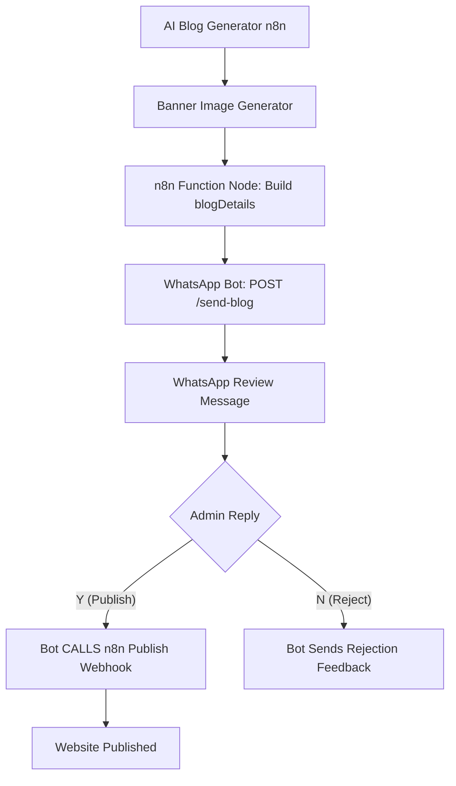

# WhatsApp Blog Review System 🚀

A production-ready WhatsApp approval system for AI-generated blogs coming from **n8n automation**. This bot allows you to manually review, approve, or reject blog posts directly from your WhatsApp chat before they are published to your website.

---

## 🏗️ System Architecture



---

## 🔥 Features

- ✅ **Instant Review**: Get blog details (Title, Excerpt, Image) as a WhatsApp message.
- 🖼️ **Image Previews**: Sends the cover image first for a visual preview in the chat.
- 📲 **Quick Approval**: Reply with **'Y'** to publish or **'N'** to reject.
- 🔄 **n8n Integration**: Seamlessly connects with your existing n8n workflows.
- 🐳 **Dockerized**: Easy deployment with Docker and Docker Compose.
- 🔐 **Persistent Session**: QR session survives container restarts using `LocalAuth`.
- 🛡️ **Error Handling**: Robust error handling for image fetching and webhook calls.

---

## 🛠️ Tech Stack

- **Node.js** (v18)
- **Express.js** (API Server)
- **whatsapp-web.js** (WhatsApp Client)
- **Axios** (HTTP Client)
- **Docker & Docker Compose**
- **Puppeteer** (Headless browser for WhatsApp Web)

---

## 🚀 Getting Started

### 1. Clone the Repository
```bash
git clone https://github.com/your-repo/whatsapp-blog-review-system.git
cd whatsapp-blog-review-system
```

### 2. Configure Environment Variables
Copy the `.env.example` to `.env` and fill in your details:
```bash
cp .env.example .env
```
Edit `.env`:
- `WHATSAPP_NUMBER`: Your WhatsApp number with country code (e.g., `919876543210`).
- `PORT`: The port for the API (default: `3000`).
- `N8N_WEBHOOK_URL`: The URL n8n listens on for publishing approvals.

### 3. Deploy with Docker
```bash
docker compose up --build -d
```

### 4. Authenticate WhatsApp
Check the logs to see the QR code:
```bash
docker logs -f whatsapp-blog-bot
```
Scan the QR code with your phone (Linked Devices in WhatsApp).

---

## 🔗 n8n Workflow Integration

### Data Structure (`blogDetails`)
The bot expects the following JSON structure via a `POST` request to `/send-blog`:

```json
{
  "title": "Scaling AI Workflows",
  "excerpt": "A deep dive into optimizing AI pipelines...",
  "content": "Full markdown content goes here...",
  "category": "Technology",
  "status": "draft",
  "featured": false,
  "tags": ["AI", "Cloud", "DevOps"],
  "coverImage": "https://example.com/image.jpg",
  "seo": {
    "title": "Scaling AI Workflows | My Blog",
    "description": "Learn how to scale AI...",
    "keywords": ["AI", "Automation"]
  }
}
```

### Example n8n Setup
1. Use an **HTTP Request** node in n8n.
2. Set Method to **POST**.
3. URL: `http://your-bot-ip:3000/send-blog`.
4. Body Content: `blogDetails`.

---

## 💡 How Approval Works

1. **Bot Receives Request**: n8n sends the blog data to the bot.
2. **Bot Sends Message**: You receive the cover image followed by a summary of the blog.
3. **Admin Actions**:
   - Reply **`Y`**: The bot sends the full `blogDetails` back to your `N8N_WEBHOOK_URL`.
   - Reply **`N`**: The bot cancels the review and notifies you.

---

## 📂 Project Structure

```text
whatsapp-blog-review-system/
├── .wwebjs_auth/       # WhatsApp persistent session (Auto-generated)
├── bot.js              # Core bot and API logic
├── Dockerfile          # Container configuration
├── docker-compose.yml  # Orchestration
├── .env.example        # Environment template
├── .gitignore          # Git exclusion rules
├── package.json        # Dependencies
└── README.md           # Documentation
```

---

## 🔧 Troubleshooting

- **QR Code not appearing?** Ensure you are checking `docker logs -f whatsapp-blog-bot`.
- **Session doesn't survive restart?** Check if the `.wwebjs_auth` volume is correctly mapped in `docker-compose.yml`.
- **Image failed to send?** Ensure the `coverImage` URL is publicly accessible.
- **n8n connection issues?** Verify that the container can reach the `N8N_WEBHOOK_URL` (use actual IP if running on the same host).

---

## ⭐ License
This project is licensed under the ISC License.

---
*Created with ❤️ for AI Automation Enthusiasts.*
